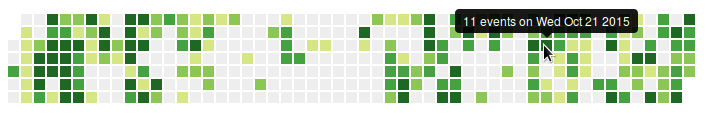

# angular-events-calendar

Calendar in the style of GitHub contributions

## Installation

Available at npm and bower as `angular-events-calendar`.

## Example

```javascript
eventList = [
  { day: '2015-01-07', count: 0 },
  { day: '2015-01-08', count: 0 },
  { day: '2015-01-09', count: 5 },
  { day: '2015-01-10', count: 0 },
  ...
  { day: '2016-01-08', count: 3 }
];
```

```html
<events-calendar events="eventList" since="2015-01-07" upto="2016-01-08">
  <div style="width: 100%; height: 100%" uib-tooltip="{{day.events}} events on {{day.date.toDateString()}}"></div>
</events-calendar>
```

## Attributes

* `events`: An array of event objects, with `count:` properties and `day:` properties.
    The days may be specified as anything that can be passed to `new Date(...)`.
* `since`, `upto` (optional): The start and end days of your calendar. Defaults to the last 1 year.
* `intensities` (optional): The number of different intensities for CSS classes,
    excluding the 0 class (See [events-calendar.css](events-calendar.css) for an
    CSS example). Defaults to 4.
* `selectable` (optional): Whether a single day can be selected. You can specify the
    property in which the selected day is stored by the `selected` attribute.
    Defaults to `true`.


